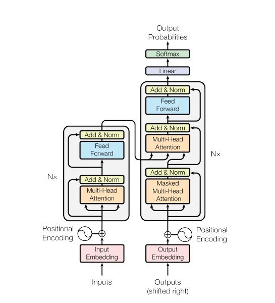

# Vie-Eng Translation Machine
Authors:
- Github: [ktoan911](https://github.com/ktoan911) 
- Email: khanhtoan.forwork@gmail.com 

Advisors:
- Github: [bangoc123](https://github.com/bangoc123) 
- Email: protonxai@gmail.com


Implementation of [Attention Is All You Need](https://arxiv.org/pdf/1706.03762.pdf) . This
library is part of our project: Building an Translation Machine Model library with ProtonX.

<p align="center">
    
</p>

This project is a Vietnamese - English translation machine using a Transformer model. It aims to provide accurate translations, bridging language barriers and meeting the demand for efficient translation tools.

## Architecture Image 




## I.  Set up environment
- Step 1: create a Conda environment named your_env_name with Python version  3.10.14

```python
conda create -n ${your_env_name} python= 3.10.14
```

- Step 2: Activate the newly created environment using the following command
```
conda activate ${your_env_name}
```

- Step 3: Install Packages from requirements.txt

```
pip install -r requirements.txt
``` 

## II.  Set up your dataset
"
This project utilized [mt_eng_vietnamese Dataset](https://huggingface.co/datasets/mt_eng_vietnamese/viewer/iwslt2015-en-vi/train?p=1)
```
from datasets import load_dataset

dataset = load_dataset('mt_eng_vietnamese', 'iwslt2015-en-vi')
```

## III. Training Process

There are some important arguments for the script you should consider when running it:

### Model config : 
To configure the model, you can adjust the following parameters:

- `max-length-input`: Maximum length of input sequences. Default is 200.
- `max-length-target`: Maximum length of target sequences. Default is 200.
- `embedding-dim`: Dimensionality of the token embeddings. Default is 32.
- `num-heads-attention`: Number of attention heads in the multi-head attention layers. Default is 2. It is in [3.2.2](https://arxiv.org/pdf/1706.03762.pdf) of the paper
- `dff`: Dimensionality of the feedforward network. Default is 512. It is in [3.3](https://arxiv.org/pdf/1706.03762.pdf) of the paper
- `num-layers`: Number of layers in the Transformer model. Default is 2.
- `d-model`: Dimensionality of the model. Default is 128. It is in [3.2.2](https://arxiv.org/pdf/1706.03762.pdf) of the paper
- `batch-size`: Batch size for training. Default is 4.
- `epochs`: Number of epochs for training. Default is 10.
- `dropout-rate`: Dropout rate for regularization. Default is 0.1.

Make sure to specify the following paths: 
- `path-train`: Path to the training dataset. This argument is required.
- `path-valid`: Path to the validation dataset. This argument is required.
- `path-test`: Path to the testing dataset. This argument is required.
- `checkpoint-path`: Path to save model checkpoints. Default is 'model_checkpoint'.

Training script:


```python

python train.py --max-length-input ${max-length-input} --max-length-target ${max-length-target} --embedding-dim ${embedding-dim} --num-heads-attention ${num-heads-attention} --dff ${dff} --num-encoder-layers ${num-encoder-layers} --d-model ${d-model} --batch-size ${batch-size} --epochs ${epochs}  --dropout-rate ${dropout-rate} --path-train ${path-train} --path-valid ${path-valid} --path-test ${path-test} --checkpoint-path ${checkpoint-path}

```


## IV. Predict Process

```bash
ppython your_script.py --path-model ${model_checkpoint} --path-tokenizer_vie ${path_to_vietnamese_tokenizer} --path-tokenizer_en ${path_to_english_tokenizer} --predict-data ${path_to_prediction_data} --max-length ${maximum_length}
```

### Arguments :
  - `path-model`: Path to the saved model.
  - `path-tokenizer_vie`: Path to the tokenizer for Vietnamese. Required.
  - `path-tokenizer_en`: Path to the tokenizer for English. Required.
  - `predict-data`: Path to the data for prediction. Required.
  - `max-length`: Maximum length of prediction strings (default is 200).

## V. Result and Comparision

Transformer Encoder model
```
Epoch 1/3
782/782 [==============================] - 57s 63ms/step - loss: 0.5410 - binary_accuracy: 0.6794 - val_loss: 0.3047 - val_binary_accuracy: 0.8703
Epoch 2/3
782/782 [==============================] - 26s 34ms/step - loss: 0.2614 - binary_accuracy: 0.8930 - val_loss: 0.2786 - val_binary_accuracy: 0.8819
Epoch 3/3
782/782 [==============================] - 29s 37ms/step - loss: 0.2004 - binary_accuracy: 0.9204 - val_loss: 0.3002 - val_binary_accuracy: 0.8784
  1/782 [..............................] - ETA: 23s - loss: 0.2095 - binary_accuracy: 0.9062
```

**FIXME**

Other architecture

```
Epoch 6/10
391/391 [==============================] - 115s 292ms/step - loss: 0.1999 - acc: 0.9277 - val_loss: 0.4719 - val_acc: 0.8130
Epoch 7/10
391/391 [==============================] - 114s 291ms/step - loss: 0.1526 - acc: 0.9494 - val_loss: 0.5224 - val_acc: 0.8318
Epoch 8/10
391/391 [==============================] - 115s 293ms/step - loss: 0.1441 - acc: 0.9513 - val_loss: 0.5811 - val_acc: 0.7875
```


The model's performance improves significantly over three epochs, with loss decreasing and accuracy increasing. 


